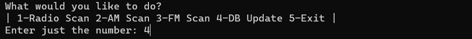

# Antenna-Backend
Backend tools for Antenna-React honors project.

## Dependencies

Any SQL database would work but MariaDB is required for my project. The required tables

## USAGE

For running the backend tools, run the following command:

``` java -jar target/Antenna-Backend-1.0-SNAPSHOT.jar ```

The program will then pull up the following menu, to fill the database, use option 4.



The program will then prompt for your username and password to the database. Make sure that you have insert rights and selection rights for the database. This operation will take some time, especially if it is the first time operation.

## Screenshots

Below are the screenshots of the required database structures for the project. Make sure that your database tables matches both of these.

Below is the AM radio table structure.


Here is the FM radio table structure below.


